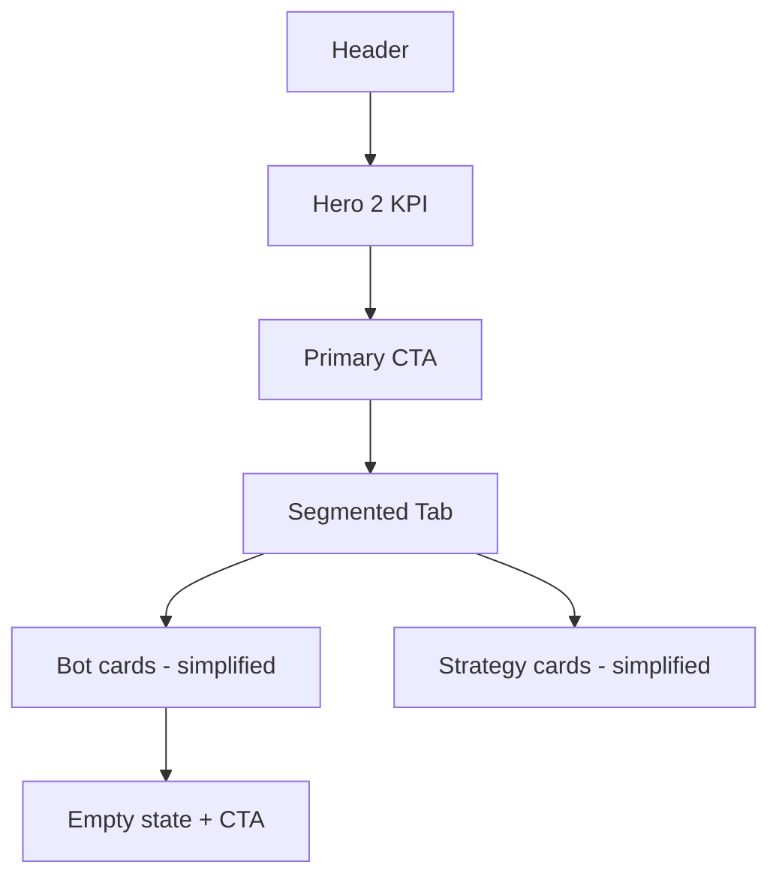

# Execution Prompt — Redesign UI Trading Bots Hub (SC-059)

**Version:** 2.0  
**Khi dùng:** Audit + redesign UI hub Trading Bots — sang, hiện đại, chuyên nghiệp chuẩn fintech thế giới; vẫn dễ dùng cho người mới.  
**Shell contract:** [AI_PROMPT_SHELL.md](../01_AI_RULES/AI_PROMPT_SHELL.md) — không lặp boilerplate shell.

**Design authority:**

| File | Vai trò |
| --- | --- |
| [AGENTS.md](../../AGENTS.md) | Product, UI rules, financial safety |
| [DESIGN.md](../../DESIGN.md) | Tokens, component ladder |
| [Flutter-Native-Design-Standard.md](Flutter-Native-Design-Standard.md) | Trust-first, beginner-friendly, no dark patterns |
| [HomePage-Flutter-Native-Standard.md](../04_SCREEN_REFERENCES/home/HomePage-Flutter-Native-Standard.md) | Chuẩn thị giác SC-007 |
| `flutter_app/lib/features/home/presentation/pages/home_page.dart` | Reference implementation |

**Phase 2 handoff:** copy khối cuối file vào chat mới sau khi Phase 1 pass gate.

---

## Design North Star

> **“Tin cậy trước, đơn giản trước, chuyên nghiệp luôn.”**

Hub Trading Bots phải cảm giác như **một sản phẩm fintech tier-1** (Binance Bots / Coinbase Advanced / Kraken Pro — **pattern**, không copy brand):
- Quét nhanh trong **≤3 giây**: biết có bao nhiêu bot, trạng thái, bước tiếp theo.
- **Một hành động chính** mỗi vùng màn hình — không wall of buttons.
- **Progressive disclosure:** chi tiết kỹ thuật ẩn sau tap/expand, không nhồi lên card.
- **Trust-first:** risk, trạng thái, P/L hiển thị rõ — không hype, không FOMO, không casino UI.

Đồng thời **thân thiện người mới:**
- Lần đầu vào → thấy ngay “Bắt đầu” / “Tạo bot đầu tiên”, không màn hình trống im lặng.
- Thuật ngữ có **micro-copy giải thích** (1 dòng) khi cần — không glossary dài.
- Chiến lược bot: so sánh **3 tiêu chí tối đa** trên card (risk, return range, phù hợp ai).

---

## Personas & hành trình bắt buộc

Thiết kế phải pass cả 3 journey — ghi trong design spec STEP 2:

| Persona | Mục tiêu | Đường đi tối thiểu (≤3 bước tap) |
| --- | --- | --- |
| **Người mới** | Tạo bot đầu tiên an toàn | Hub → tab Chiến lược → chọn strategy → sheet tạo → confirm |
| **User thường** | Bật/tắt bot nhanh | Hub → tab Bot của tôi → toggle 1 tap |
| **User có kinh nghiệm** | Xem tổng quan portfolio bot | Hub → hero metrics → scan list → (optional) sub-page analytics |

**Empty state bắt buộc:** tab “Bot của tôi” khi `bots.isEmpty` — illustration/icon + headline + 1 CTA primary + 1 link secondary (“Xem hướng dẫn” nếu route có sẵn).

---

## Mục tiêu

1. **Audit** UI hub SC-059 theo North Star + anti-patterns bên dưới.
2. **Redesign** gọn, sang, hiện đại — hierarchy rõ như Home, density thấp hơn hiện tại.
3. **Giữ** enterprise compliance: `Vit*`, tokens, test keys, financial safety.
4. **Deliver** before/after spec có thể verify bằng test + visual check 360px.

---

## Anti-patterns — phải loại bỏ (từ UI hiện tại)

Audit và fix các vấn đề sau nếu còn tồn tại:

| Anti-pattern | Vì sao xấu | Hướng sửa |
| --- | --- | --- |
| Card trong card (`VitCard` lồng mini-stat) | Visual noise, không sang | Flat row stats hoặc 1 divider, không nested card |
| >2 action cùng hàng trên bot card (toggle + settings + delete) | Cognitive overload | Primary = toggle; secondary → menu/`VitIconButton` gom hoặc swipe/long-press pattern có confirm |
| 3+ metric trên 1 dòng summary nhỏ | Khó đọc 360px | Hero 2 metric chính + “Xem thêm” hoặc carousel 2-up |
| Description dài trên strategy card | Người mới bỏ cuộc | Max 2 dòng + ellipsis; chi tiết trong sheet |
| Section title lặp (“Tổng quan”, “Danh mục”) không thêm giá trị | Clutter | Gộp section; chỉ giữ title khi nhóm nội dung khác biệt |
| Local widget trùng `Vit*` | Không enterprise | Thay bằng shared primitive |
| Magic spacing/radius | Drift design system | Chỉ `AppSpacing` / `AppRadii` |
| Icon-only không tooltip/semantics | A11y fail | `tooltip` + `Semantics` |

---

## Phạm vi (scope)

### Trong scope — Phase 1

| Mục | Path |
| --- | --- |
| Hub | `trading_bots_page.dart` + `part_01`…`part_04` |
| Test | `test/features/trade/trading_bots_page_test.dart` |
| Layout (chỉ nếu block) | `trade_module_layout.dart`, `vit_trade_simple_shell.dart` |

### Ngoài scope Phase 1

Trang vệ tinh `bot_*` — audit liệt kê link từ hub; redesign batch Phase 2.

### Không được làm

- Pub dependency mới.
- Đổi route, repository contract, business logic bot.
- Xóa/đổi `Key` test `sc059_*`.
- Redesign toàn module bot trong một chat.
- Dark pattern: countdown giả, “limited slots”, màu neon hype.

---

## Chuẩn thiết kế — map Home → Trading Bots

Mirror **cấu trúc** Home, **accent** module Trade (primary orange giữ nguyên token):

| Home (SC-007) | Trading Bots hub (SC-059) |
| --- | --- |
| Auto-hide header + scroll content | `VitTradeHubScaffold` hoặc shell Trade tương đương — không local scaffold |
| Hero / balance summary | Hero bot portfolio: running count + total P/L (2 số nổi bật) |
| Primary next action | “Tạo bot” / “Khám phá chiến lược” — 1 CTA sticky hoặc above fold |
| Product grid / recent strip | Bot list hoặc strategy cards — card height đồng nhất, scan được |
| Announcement / hint | 1 dòng risk disclaimer hoặc link “Hiểu rủi ro bot” (nếu route có) |
| Section rhythm `sectionGap` | Tối đa **3 section** above fold: Hero → Tab → Content |
| `VitSegmentedChoice` / tab | Tab “Bot của tôi” \| “Chiến lược” — **không** bọc tab trong `VitCard` border |
| Empty states có CTA | Empty bot list + empty strategy fallback |
| `AppTextStyles.heroNumber` / `sectionTitle` | Metrics dùng `heroNumber` hoặc `numericCode`; title dùng `sectionTitle` |
| Dark surfaces `surface` / `surface2` | Không custom background ngoài tokens |

### Component ladder (bắt buộc)

`VitCard`, `VitCtaButton`, `VitTabBar` / `VitSegmentedTabBar`, `VitSegmentedChoice`, `VitStatusPill`, `VitAccentPill`, `VitIconButton`, `VitPresetChipRow` — trước mọi local widget.

Radius: `inputRadius` (controls), `cardRadius` / `cardLargeRadius` (cards), `pillRadius` (status). **Không** `BorderRadius.circular()` ngoài `app_radii.dart`.

### Skills (đọc trước khi code)

- `.codex/skills/vittrade-ui-checklists/SKILL.md` — translate `ibelick/baseline-ui` sang Flutter
- `.codex/skills/vittrade-minimal-review/SKILL.md` — batch self-check
- `.codex/skills/ui-ux-pro-max/SKILL.md` — **chỉ** lấy UX guidelines fintech/dashboard; **bỏ** Tailwind/React rules

---

## IA & content hierarchy

Thứ tự scroll mục tiêu (phone 360px):

```text
1. Header: "Trading Bots" + subtitle ngắn (1 dòng value prop)
2. Hero metrics (2 KPI) — optional tertiary collapsed
3. Primary CTA (full-width hoặc prominent)
4. Segmented tab
5. Content list (bot cards HOẶC strategy cards)
6. Footer micro-disclaimer risk (1 dòng, text3)
```

**Mật độ card bot (target sau redesign):**

- Row 1: icon + tên strategy + status pill + P/L (right-aligned)
- Row 2: pair + 1–2 stat phụ (investment HOẶC runtime — không cả 3)
- Row 3: **1** primary action (toggle) + overflow menu cho settings/delete

**Mật độ card strategy (target):**

- Tên + risk pill
- Mô tả ≤2 dòng
- 2 chip metric (return range, suitable for)
- 1 CTA “Tạo bot”

---

## Copy & tone (tiếng Việt)

- **Headline:** động từ + lợi ích (“Tự động hóa giao dịch”, không “Trading Bots Module”).
- **Label:** ≤3 từ (“Đang chạy”, “Tạm dừng”, “Lãi/lỗ”).
- **Risk:** factual (“Bot không đảm bảo lợi nhuận”), không cảnh báo đe dọa.
- **CTA:** verb-first (“Tạo bot”, “Tiếp tục”, “Xem chiến lược”).
- Tránh: “Kiếm tiền ngay”, “Lợi nhuận khủng”, emoji trang trí.

---

## Financial safety

- Giữ preview/confirm trong `_CreateBotSheet`; terms/risk nếu flow có.
- Toggle pause/play: feedback tức thì (optimistic UI ok nếu test pass).
- Delete: confirm dialog — không xóa 1 tap.
- P/L và investment: màu semantic `buy`/`sell`; tabular figures.
- Không ẩn phí/risk để làm UI “sạch”.

---

## Quy trình thực thi

### STEP 0 — Khám phá (read-only)

1. GitNexus: `query({query: "TradingBotsPage"})`, `context({name: "TradingBotsPage"})`.
2. Đọc hub parts + Home sections tương ứng (không paste full file).
3. Baseline test:

```bash
cd flutter_app
flutter test test/features/trade/trading_bots_page_test.dart --reporter=compact
```

4. (Optional) Token/component audit nếu đụng nhiều shared UI:

```bash
dart run tool/design_token_consistency_audit.dart --check
dart run tool/body_component_consistency_audit.dart --check
```

### STEP 1 — Audit UI

Deliverable: bảng + **điểm clutter 1–10** (before) cho hub.

| # | Vấn đề | File/vùng | P0–P2 | Anti-pattern | Fix (1 dòng) |
| --- | --- | --- | --- | --- | --- |
| … | … | … | … | … | … |

Nhóm audit:

- North Star & 3 personas journey
- Anti-patterns (bảng trên)
- Visual hierarchy vs Home map
- `Vit*` compliance
- Beginner empty/error states
- A11y (semantics, tooltip, touch ≥44px)
- Test key stability

**Không dừng hỏi user — chuyển STEP 2 ngay.**

### STEP 2 — Design spec

Deliverables bắt buộc:

1. **Wireframe** (text hoặc mermaid) — đúng IA section ở trên.
2. **Before/after** — 3 bullet thay đổi lớn nhất (density, CTA, empty state).
3. **Persona check** — tick 3/3 journey pass.
4. **Component map** — widget nào giữ, xóa, thay `Vit*`.

Template mermaid gợi ý:



### STEP 3 — Implementation

- Trước mỗi symbol: `impact({target, direction: "upstream"})` — báo blast radius.
- Minimal diff; xóa local duplicate khi thay `Vit*`.
- Giữ `tradeBotsControllerProvider`, sheet tạo bot, toast success behavior.
- Verify **360px width** — không overflow ellipsis trên CTA/label chính.

### STEP 4 — Verification

```bash
dart format --output=none --set-exit-if-changed lib/features/trade/presentation/pages/trading_bots_page*.dart test/features/trade/trading_bots_page_test.dart
flutter analyze
flutter test test/features/trade/trading_bots_page_test.dart --reporter=compact
```

Test bắt buộc cover (cập nhật nếu copy đổi, **giữ** `sc059_*` keys):

- Tab switch myBots ↔ strategies
- Toggle bot running/paused
- Create bot sheet flow
- Empty state visible khi không có bot (nếu mock hỗ trợ)

Visual: viewport `Size(360, 800)` trong test hoặc ghi note manual QA.

### STEP 5 — Batch self-check

`vittrade-minimal-review`: no one-caller helper, no wrapper 1 lớp, no pub mới.

Post **clutter score after** (target ≤4/10).

---

## Acceptance criteria (Phase 1 gate)

- [ ] Audit + design spec + before/after + persona 3/3 trong chat.
- [ ] Clutter score after ≤4/10 (giảm ≥3 điểm so với before, hoặc before ≤4 thì giữ/improve).
- [ ] Above fold ≤3 section; bot card ≤3 visual rows; strategy description ≤2 dòng.
- [ ] Empty state beginner-friendly với primary CTA.
- [ ] Visual language align Home + `Flutter-Native-Design-Standard`.
- [ ] 100% `Vit*` + theme tokens; no magic radius/spacing.
- [ ] `flutter analyze` clean; `trading_bots_page_test.dart` pass.
- [ ] No navigation regression từ Trade module.
- [ ] Risk/disclaimer không bị xóa để “làm đẹp”.

**Completion line:** `TRADING BOTS HUB UI REDESIGN DONE — SC-059 v2`

Handoff nếu hết context:

```text
RESUME FROM: Phase 1 — STEP <n>
```

---

## Batch discipline

- Max **5–10 files**/chat.
- Phase 1 = hub only; Phase 2 = `bot_*` batches.
- Cursor **Auto** only.
- Visual QA riêng chat: `/browse` sau `flutter run -d chrome` ([Flutter-Visual-QA.md](Flutter-Visual-QA.md)).

---

## Bắt đầu ngay

STEP 0 → STEP 1 → STEP 2 → STEP 3 liên tục đến pass gate hoặc handoff.

---

## Phase 2 handoff prompt

```markdown
RESUME FROM: Phase 2 — Redesign bot sub-pages

Shell: docs/01_AI_RULES/AI_PROMPT_SHELL.md
Parent: docs/02_FLUTTER_MIGRATION/prompt-redesign-trading-bots-hub-sc059.md (v2)

North Star + anti-patterns + Home map trong parent vẫn áp dụng.
Scope batch: <2–4 file bot_* + tests>
Persona: giữ beginner journey cho guide/FAQ/suitability pages.

Completion: TRADING BOTS SUB-PAGES UI REDESIGN DONE — <batch id>
```
