# Notice Acknowledgement Rollout Plan

**Status:** Complete (2026-07-20) — Phase 0–6 landed; baseline empty; guardrail green  

**Goal:** Make `showVitNoticeSheet` the default acknowledgement UI app-wide; keep sticky footers only for in-progress form CTAs; lock with a ratchet guardrail.  
**Related:** [Bottom-Sheet-Standard.md](./Bottom-Sheet-Standard.md) (wrapper only — do not conflate).

## Classification (source of truth for later standard)

| Job | Required pattern | Keep as-is |
| --- | --- | --- |
| Success / error / “coming soon” / must-ack | `showVitNoticeSheet` | — |
| Form CTA while editing (Submit / Next / Emergency Stop) | `VitStickyFooter` / `VitTradeDetailScaffold.footer` | Yes |
| Financial preview/confirm | `VitPreviewConfirmSheet` / dedicated form sheets | Yes |
| Persistent inline status (offline, form field errors) | Inline `VitBanner` / `VitOfflineBanner` | Yes |
| Shared sheet chrome | `showVitBottomSheet` | Yes ([Bottom-Sheet-Standard.md](./Bottom-Sheet-Standard.md)) |

**Forbidden for acknowledgements:** `SnackBar`, `Stack`+`Positioned` success toasts, sticky Share+Continue dual CTAs after an action.

**Reference (already correct):** Trade submit + receipt — `trade_page_state.dart`, `order_receipt_page.dart`.

---

## Phase 0 — Document + agent rules (one chat, before any migrate)

| Deliverable | Path |
| --- | --- |
| New mandatory standard | `docs/02_FLUTTER_MIGRATION/standards/Notice-Acknowledgement-Standard.md` (mirror structure of Scroll-Auto-Hide-Standard: Authority, Rules, Anti-patterns, Verify, Exceptions) |
| Domain map row | `docs/02_FLUTTER_MIGRATION/Flutter-Design-System-Reference.md` §2 + page checklist |
| Product contract | `AGENTS.md` UI Rules — 1–3 lines |
| Cursor rule | `.cursor/rules/vittrade-notice-acknowledgement.mdc` (globs presentation) |
| Claude lazy rule | `.claude/rules/ui-visual-standards.md` — one Domain contracts row |

**Gate:** docs only; no `flutter test` required.

---

## Phase 1–5 — Migrate batches (≤5–10 files per chat)

Each batch: GitNexus `impact` → replace overlay/SnackBar with `showVitNoticeSheet` → focused tests → analyze → shrink baseline once guardrail exists.

### Batch 1 — Trade / futures / bots overlays (P0)

| File | Change |
| --- | --- |
| `features/trade/presentation/widgets/futures/futures_page_state.dart` | Success `Positioned` VitBanner → sheet (`ctaVariant: success`) |
| `features/trade/presentation/pages/hub/orders_history_page.dart` | Cancel-success overlay → sheet |
| `features/trade_bots/presentation/pages/hub/trading_bots_page.dart` | Remove Stack+Positioned success; after create → `showVitNoticeSheet` |
| `features/trade/presentation/widgets/hub/trade_history_export_footer.dart` | Post-export success strip → sheet; keep sticky export CTA if still form action |

**Verify:** focused trade/bots tests + analyze.

### Batch 2 — Compliance cluster

| Scope | Change |
| --- | --- |
| best_execution / venue / slippage / regulatory_reports_dashboard pages | Overlay success → sheet |
| `transaction_reporting_notice.dart` + page | Bottom-pinned success banner → sheet |
| Optional | Shared `_showComplianceNotice` helper wrapping `showVitNoticeSheet` |

**Verify:** compliance tests if present; analyze; ratchet baseline.

### Batch 3 — Terminal demos + Earn toasts

| Scope | Change |
| --- | --- |
| advanced_tools / risk_management / execution_quality demos + `ExecutionQualitySuccessToast` | → sheet; delete dead toast widgets |
| `staking_auto_compound_page.dart`, `auto_compound_settings_page.dart` | `_SuccessToast` Positioned → sheet |
| Earn shared `_SuccessToast` files | Delete when zero callers |

**Verify:** earn/terminal tests; ratchet baseline.

### Batch 4a–4d — SnackBar coming-soon / mock ack

Canonical helper per module (or shared):

```dart
Future<void> _showComingSoon(
  BuildContext context, {
  required String title,
  required String message,
}) =>
    showVitNoticeSheet(context: context, title: title, message: message);
```

| Sub-batch | Scope |
| --- | --- |
| 4a | Earn/staking SnackBar sites (~10–12 files) |
| 4b | DCA + predictions SnackBar |
| 4c | Launchpad + P2P + profile |
| 4d | Wallet + admin + residual |

Keep prior SnackBar copy as `message` (vi-VN). Ratchet baseline after each sub-batch.

### Batch 5 — Arena / DCA “Đã hiểu” + transfer success

| File | Change |
| --- | --- |
| `arena_challenge_detail_page.dart` | Custom Đã hiểu sheet → `showVitNoticeSheet` |
| `dca_page_history_and_create_sheet.dart` | Intro Đã hiểu → notice sheet (or document exception if true multi-step onboarding) |
| `transfer_page.dart` + `TransferSuccessBanner` | Inline success → sheet; delete unused banner |
| Predictions order receipt Share SnackBar | → sheet |

**Verify:** arena/dca/wallet/predictions focused tests; ratchet.

### Batch 6 — Residual sweep

- Re-scan `showSnackBar`, `Positioned`+`VitBanner` success, `_SuccessToast`, `TransferSuccessBanner`
- Predictions receipt **navigation** dual CTAs stay if body nav (not sticky notice)
- Baseline empty or only documented `// notice-ack: allow-*` paths

---

## Phase 6 — Guardrail (required; introduce after Batch 1)

| Artifact | Path |
| --- | --- |
| Guardrail test | `flutter_app/test/quality/notice_acknowledgement_guardrail_test.dart` |
| Baseline | `flutter_app/test/quality/notice_acknowledgement_baseline.txt` |

**Banned** under `lib/features/**/presentation/` (except allowlist / baseline / marker):

1. `showSnackBar` / `ScaffoldMessenger`…`showSnackBar`
2. Success-toast heuristics: `_SuccessToast`, `TransferSuccessBanner`, `ExecutionQualitySuccessToast`, and `Positioned` collocated with success `VitBanner` patterns (substring scan + allowlist, same style as `bottom_sheet_guardrail_test.dart`)

**Hard allow:** `vit_offline_banner.dart`, tests, data fixtures, listed marketing dismiss paths (e.g. home announcement).

**Opt-out:** `// notice-ack: allow-<reason>` on the line (documented in the standard).

**Ratchet:** seed full debt after Batch 1 → remove lines as batches land → empty after Batch 6.

```mermaid
flowchart LR
  P0[Phase0 docs] --> B1[Batch1 Trade bots]
  B1 --> G0[Guardrail plus full baseline]
  G0 --> B2[Batch2 compliance]
  B2 --> R2[Ratchet]
  R2 --> B3[Batch3 earn terminal]
  B3 --> R3[Ratchet]
  R3 --> B4[Batch4 SnackBars]
  B4 --> R4[Ratchet]
  R4 --> B5[Batch5 arena DCA transfer]
  B5 --> R5[Ratchet]
  R5 --> B6[Batch6 sweep]
  B6 --> Done[Baseline empty]
```



---

## Chat sequence (Cursor)

1. Chat A — Phase 0 only  
2. Chat B — Batch 1 + introduce guardrail/baseline  
3. Chats C… — one batch (or 4a/4b/…) per chat; ratchet at end  
4. Final chat — Batch 6 + baseline empty + Design-System-Reference CI note  

Do not merge multiple modules in one chat (>10 files).

---

## Out of scope

- Converting form `VitStickyFooter` to sheets  
- Changing `VitPreviewConfirmSheet` / create-bot / pickers  
- Forcing Predictions receipt nav CTAs into notice sheets  
- Dedicated CI named step (optional after baseline = 0; until then rides `flutter test`)

---

## Done when

- [x] Standard + AGENTS + Cursor/Claude rules shipped  
- [x] Zero success overlays / local success toasts outside allow  
- [x] Zero presentation `showSnackBar` outside allow + markers  
- [x] Guardrail green with empty (or documented) baseline  
- [x] Flutter-Design-System-Reference §2 lists Notice acknowledgement  

## Inventory snapshot (post-rollout 2026-07-20)

| Category | Status |
| --- | --- |
| `showVitNoticeSheet` as default ack | Done |
| Positioned / overlay success | Migrated (Batches 1–3) |
| Inline success banners / TransferSuccessBanner | Migrated (Batch 5) |
| SnackBar ack / coming-soon | Migrated (Batch 4a–4d) |
| Custom Đã hiểu sheets | Arena → notice sheet; DCA create intro kept with `// notice-ack: allow-onboarding` |
| Legitimate sticky form footers | Kept |
| Baseline | Empty |
